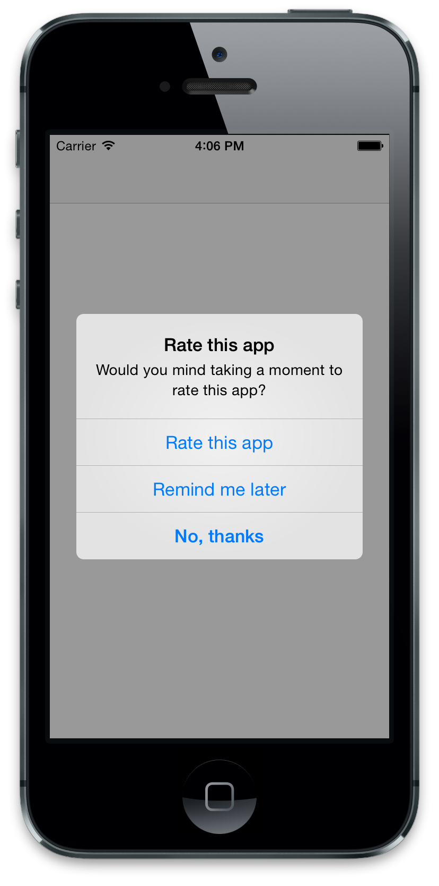

# ti-rate-reminder

> Rate reminder for Titanium apps

After 10 launches it asks the user if they would like to rate the app.

*Works on iOS and Android.*




## Install

In the `Resources` directory:

```
$ npm install ti-rate-reminder
```


## Usage

```js
const rateReminder = require('node_modules/ti-rate-reminder/index');

rateReminder({appleAppId: '702364884'});
```

## API

### rateReminder(options)

#### options

Type: `Object`

##### appleAppId

*Required*<br>
Type: `string`

The app `Apple ID` from iTunes Connect.

##### interval

Type: `number`<br>
Default: `10`

How many app launches before showing the rate reminder dialog.


## Localization

You can localize the text used in the rate reminder dialog by copying the `node_modules/ti-rate-reminder/i18n` directory into the root directory to get the bundled localizations and optionally add your own.

Read the [Titanium guide on localization](https://wiki.appcelerator.org/display/guides2/Internationalization).


## License

MIT © [Sindre Sorhus](https://sindresorhus.com)
